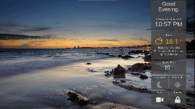

# HA Dashboard - Remote Control

## Description
I wanted a dashboard for my dumb TV in the bedroom. Similar to the ones at you find in Hotel Rooms these days.

This assumes you have AppDaemon/HADashboard setup and are familiar with creating custom skins etc.

Also this is based on using a Raspberry Pi plugged into the TV HDMI and it has CEC Enabled.

I am still working on the dashboard itself, but wanted to ensure it was possible to use my remote control before I went to far with it.



## Installation

### Setting Up Kiosk Mode

Plenty of [websites detailing this](https://www.danpurdy.co.uk/web-development/raspberry-pi-kiosk-screen-tutorial/) process but in general.


You need to edit your autostart file.

```sudo nano /etc/xdg/lxsession/LXDE-pi/autostart```

Comment out ```@xscreensaver -no-splash``` with a # to stop screensavers.

Then add the following to stop inactivity blanking:
```
@xset s off
@xset -dpms
@xset s noblank
```

Finally add the chromium-browser to autostart, in kiosk mode to your dashboard url:

```

@chromium-browser --noerrdialogs --kiosk http://hadashboardurl:5050/mydashboard --incognito

```

In the end it should look something liking this:

```
@lxpanel --profile LXDE
@pcmanfm --desktop --profile LXDE
#@xscreensaver -no-splash
@xset s off
@xset -dpms
@xset s noblank
@chromium-browser --noerrdialogs --kiosk http://hadashboardurl:5050/mydashboard --incognito
```

### Optional - Hide Mouse Cursor
If you want to hide the mouse cursor, install unclutter:
```
sudo apt install unclutter
```

Then add to your ```/etc/xdg/lxsession/LXDE-pi/autostart```

```
@unclutter -idle 0
```

## Add Javascript to Skin to Make Widget Focusable

Next we need to make the widgets that have a click state focusable so they can be iterated via a tab key, and then map a button press (Enter) to a Left Click (helper.js)

```js
document.addEventListener("keyup", function(event) {
  event.preventDefault();
  if (event.keyCode === 13) {
    document.activeElement.click();
    //console.log("Enter!")
  }
});

$(document).ready(function() {
  // Find all switches. Mostly Spans with a class .toggle-area
  var switchList = $(".toggle-area");
  //set tab index to starts from 1
  tabindex = 0;
  //console.log(tabindex);

  switchList.each(function() {
    // add tab index number to each list items
    tabindex++;
    $(this).attr("tabindex", tabindex);
    // Set Tab Index
    var tabIndex = $(this).attr("tabindex");
  });
});

```

Ensure the skin loads this javascript file by adding it as ```head_includes:``` in your ```variables.yaml``` file.

So:
```yaml
head_includes:
  - <script type="text/javascript" src="/custom_css/myawesomeskin/js/helpers.js"></script>
```

You should now be able to move through your items by pressing TAB or SHIFT + TAB

To make it clearer which item is currently in focus, add to your skins ```dashboard.css```
```css
*:focus {
    outline: #ffe139 solid 3px;
}
```

## Setting up CEC to Keyboard Mapping

Next we need to install ```cec-utils``` to allow cec (remote control) inputs and ```xdotool``` to map various cec presses to keyboard controls.

```bash
sudo apt install cec-utils xdotool 
```

I used [this reference](https://ubuntu-mate.community/t/controlling-raspberry-pi-with-tv-remote-using-hdmi-cec/4250) but  removed all bits regarding mouse controls and things I didn't need.

To test it out:
```
cec-client -o "HomeAssistant" | ./cecremote.sh
```

Press the arrow keys on your remote. Press Enter on item. Hopefully it works.

Set it to autorun on start using cron by editing the ```remotestart.sh``` script so it has the correct full path to the script.

Then use ```crontab -e``` and have it start at boot using:

```crontab
@reboot /home/pi/scriptdir/remotestart.sh > /dev/null 2>&1
```


## Acknowledgments
* [https://ubuntu-mate.community/t/controlling-raspberry-pi-with-tv-remote-using-hdmi-cec/4250](https://ubuntu-mate.community/t/controlling-raspberry-pi-with-tv-remote-using-hdmi-cec/4250)
* [https://www.danpurdy.co.uk/web-development/raspberry-pi-kiosk-screen-tutorial/](https://www.danpurdy.co.uk/web-development/raspberry-pi-kiosk-screen-tutorial/)